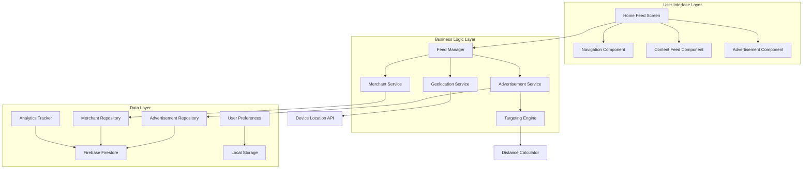
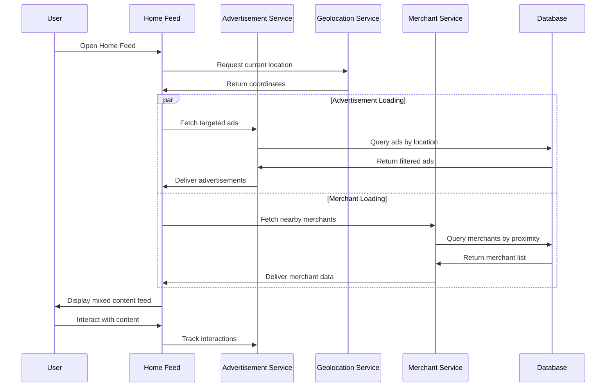

# Design Document: User Home Feed with Geolocation-Based Advertisements

## Overview

The User Home Feed is a central hub for LocaCharge users, providing a personalized content experience that seamlessly integrates geolocation-based advertisements with useful local merchant information. This design implements a native advertising approach where promotional content feels organic within the user's discovery journey.

The system leverages real-time geolocation to deliver relevant advertisements created by administrators while maintaining user privacy and providing transparent advertising practices. The feed structure prioritizes user value through nearby merchant discovery while creating monetization opportunities through targeted advertising.

## Architecture

### High-Level Architecture



### Component Interaction Flow



## Components and Interfaces

### 1. Home Feed Screen Component

**Purpose**: Main container managing the user's home feed experience

**Key Responsibilities**:
- Coordinate content loading from multiple sources
- Manage feed state and user interactions
- Handle pull-to-refresh functionality
- Implement navigation between feed and detail screens

**Interface**:
```dart
class HomeFeedScreen extends StatefulWidget {
  const HomeFeedScreen({Key? key}) : super(key: key);
}

class _HomeFeedScreenState extends State<HomeFeedScreen> {
  final FeedManager _feedManager = FeedManager();
  final ScrollController _scrollController = ScrollController();
  
  Future<void> _refreshFeed();
  void _onContentTap(ContentItem item);
  void _trackScrollPosition();
}
```

### 2. Advertisement Service

**Purpose**: Manages advertisement fetching, filtering, and interaction tracking

**Key Responsibilities**:
- Fetch advertisements from admin-created content
- Apply geolocation-based filtering
- Track impressions and click-through rates
- Handle advertisement reporting and privacy controls

**Interface**:
```dart
class AdvertisementService {
  Future<List<Advertisement>> fetchTargetedAds({
    required Location userLocation,
    required double radiusKm,
    int? limit,
  });
  
  void trackImpression(String adId);
  void trackClick(String adId);
  Future<void> reportAd(String adId, String reason);
  String getTargetingExplanation(Advertisement ad);
}
```

### 3. Geolocation Service

**Purpose**: Handles location permissions and coordinate management

**Key Responsibilities**:
- Request and manage location permissions
- Provide current user coordinates
- Handle location privacy settings
- Implement fallback strategies for location unavailability

**Interface**:
```dart
class GeolocationService {
  Future<LocationPermissionStatus> requestPermission();
  Future<Location?> getCurrentLocation();
  bool get isLocationEnabled;
  Stream<Location> get locationStream;
  
  double calculateDistance(Location from, Location to);
}
```

### 4. Content Feed Component

**Purpose**: Renders the scrollable feed mixing advertisements and organic content

**Key Responsibilities**:
- Implement lazy loading for performance
- Mix advertisements with organic content at specified intervals
- Handle different content types (ads, merchants, recommendations)
- Manage loading states and error handling

**Interface**:
```dart
class ContentFeedComponent extends StatelessWidget {
  final List<ContentItem> items;
  final VoidCallback? onRefresh;
  final Function(ContentItem) onItemTap;
  final ScrollController? scrollController;
  
  const ContentFeedComponent({
    Key? key,
    required this.items,
    this.onRefresh,
    required this.onItemTap,
    this.scrollController,
  }) : super(key: key);
}
```

### 5. Targeting Engine

**Purpose**: Implements advertisement targeting logic based on various criteria

**Key Responsibilities**:
- Apply proximity-based filtering
- Respect user preferences and privacy settings
- Implement fallback targeting when location is unavailable
- Calculate relevance scores for advertisement ranking

**Interface**:
```dart
class TargetingEngine {
  List<Advertisement> filterByProximity({
    required List<Advertisement> ads,
    required Location userLocation,
    required double radiusKm,
  });
  
  List<Advertisement> applyUserPreferences({
    required List<Advertisement> ads,
    required UserPreferences preferences,
  });
  
  List<Advertisement> getFallbackAds(int limit);
}
```

## Data Models

### Advertisement Model

```dart
class Advertisement {
  final String id;
  final String title;
  final String description;
  final String imageUrl;
  final String merchantId;
  final Location? targetLocation;
  final double? targetRadiusKm;
  final AdvertisementType type;
  final DateTime createdAt;
  final DateTime? expiresAt;
  final bool isActive;
  final Map<String, dynamic> targetingCriteria;
  final String? callToAction;
  
  const Advertisement({
    required this.id,
    required this.title,
    required this.description,
    required this.imageUrl,
    required this.merchantId,
    this.targetLocation,
    this.targetRadiusKm,
    required this.type,
    required this.createdAt,
    this.expiresAt,
    required this.isActive,
    required this.targetingCriteria,
    this.callToAction,
  });
}

enum AdvertisementType {
  banner,
  card,
  promotional,
  sponsored
}
```

### Content Item Model

```dart
abstract class ContentItem {
  final String id;
  final ContentType type;
  final DateTime timestamp;
  
  const ContentItem({
    required this.id,
    required this.type,
    required this.timestamp,
  });
}

class MerchantContentItem extends ContentItem {
  final String merchantId;
  final String name;
  final List<String> services;
  final double rating;
  final double distanceKm;
  final String imageUrl;
  
  const MerchantContentItem({
    required String id,
    required this.merchantId,
    required this.name,
    required this.services,
    required this.rating,
    required this.distanceKm,
    required this.imageUrl,
    required DateTime timestamp,
  }) : super(id: id, type: ContentType.merchant, timestamp: timestamp);
}

class AdvertisementContentItem extends ContentItem {
  final Advertisement advertisement;
  
  const AdvertisementContentItem({
    required String id,
    required this.advertisement,
    required DateTime timestamp,
  }) : super(id: id, type: ContentType.advertisement, timestamp: timestamp);
}

enum ContentType {
  advertisement,
  merchant,
  recommendation,
  section
}
```

### Location Model

```dart
class Location {
  final double latitude;
  final double longitude;
  final double? accuracy;
  final DateTime timestamp;
  
  const Location({
    required this.latitude,
    required this.longitude,
    this.accuracy,
    required this.timestamp,
  });
  
  double distanceTo(Location other) {
    // Haversine formula implementation
  }
}
```

### User Preferences Model

```dart
class UserPreferences {
  final String userId;
  final bool locationTrackingEnabled;
  final AdvertisementFrequency adFrequency;
  final List<String> blockedMerchantIds;
  final List<String> preferredCategories;
  final bool analyticsEnabled;
  
  const UserPreferences({
    required this.userId,
    required this.locationTrackingEnabled,
    required this.adFrequency,
    required this.blockedMerchantIds,
    required this.preferredCategories,
    required this.analyticsEnabled,
  });
}

enum AdvertisementFrequency {
  low,    // Every 6-8 items
  medium, // Every 4-5 items
  high    // Every 2-3 items
}
```

## Correctness Properties

*A property is a characteristic or behavior that should hold true across all valid executions of a system—essentially, a formal statement about what the system should do. Properties serve as the bridge between human-readable specifications and machine-verifiable correctness guarantees.*

### Property 1: Navigation Tab Consistency
*For any* user interaction with the navigation system, when the user is on the home feed screen, the "Accueil" tab should be marked as active
**Validates: Requirements 1.3**

### Property 2: Advertisement Geolocation Filtering
*For any* set of advertisements and user location, the proximity filter should only return advertisements for merchants within the specified radius
**Validates: Requirements 2.2, 3.1**

### Property 3: Advertisement Labeling Compliance
*For any* advertisement displayed in the feed, it should include a "Sponsorisé" indicator to maintain transparency
**Validates: Requirements 2.4**

### Property 4: Merchant Distance Filtering
*For any* user location, the nearby merchants section should only display merchants within 5km and limit results to maximum 5 merchants
**Validates: Requirements 4.2, 4.5**

### Property 5: Merchant Card Information Completeness
*For any* merchant card displayed, it should contain merchant name, services, rating, and distance information
**Validates: Requirements 4.3**

### Property 6: Advertisement Insertion Frequency
*For any* content feed with sufficient items, banner advertisements should be inserted every 4-5 content items during scrolling
**Validates: Requirements 5.2**

### Property 7: Content Refresh Functionality
*For any* pull-to-refresh gesture on the content feed, it should trigger content updates and show appropriate loading indicators
**Validates: Requirements 5.3, 5.4**

### Property 8: Offline Content Availability
*For any* previously loaded content, it should remain accessible when network connectivity is unavailable
**Validates: Requirements 5.5**

### Property 9: Admin-User Advertisement Integration
*For any* advertisement created by an administrator, it should become available for display in user feeds according to its targeting parameters
**Validates: Requirements 6.1, 6.2**

### Property 10: Real-time Advertisement Management
*For any* advertisement deactivated by an administrator, it should immediately stop appearing in user feeds
**Validates: Requirements 6.3**

### Property 11: Advertisement Interaction Tracking
*For any* user interaction with an advertisement (impression or click), it should be properly tracked for analytics purposes
**Validates: Requirements 6.4**

### Property 12: Image Lazy Loading Behavior
*For any* images in the content feed, they should only be loaded when they become visible or are about to become visible to the user
**Validates: Requirements 7.2**

### Property 13: Advertisement Image Preloading
*For any* advertisements in the feed, their images should be preloaded to prevent loading delays during user scrolling
**Validates: Requirements 7.4**

### Property 14: Error Recovery Mechanisms
*For any* failed content load operation, the system should implement retry mechanisms with appropriate error handling
**Validates: Requirements 7.5**

### Property 15: Advertisement Transparency Features
*For any* advertisement displayed, it should provide a "Pourquoi cette pub ?" option that explains the targeting criteria when accessed
**Validates: Requirements 8.1, 8.2**

### Property 16: Location Privacy Compliance
*For any* user location data processing, it should respect the user's privacy settings and not store location data unnecessarily
**Validates: Requirements 8.4**

### Property 17: Advertisement Reporting Functionality
*For any* advertisement reported as inappropriate by a user, it should be hidden from that user's feed and flagged for administrative review
**Validates: Requirements 8.5**

## Error Handling

### Location Services Error Handling

**Location Permission Denied**:
- Gracefully fallback to non-targeted advertisements
- Display general content without location-based filtering
- Provide clear messaging about reduced functionality
- Offer settings link to enable location services

**Location Service Unavailable**:
- Cache last known location for limited targeting
- Use IP-based approximate location as fallback
- Display general advertisements when no location data available
- Implement retry mechanisms for temporary service outages

**GPS Accuracy Issues**:
- Use network-based location as backup
- Implement location validation to filter unrealistic coordinates
- Apply larger radius buffers for low-accuracy locations
- Provide user feedback about location accuracy limitations

### Advertisement Loading Error Handling

**Network Connectivity Issues**:
- Display cached advertisements when available
- Show appropriate loading states and error messages
- Implement exponential backoff for retry attempts
- Provide manual refresh options for users

**Advertisement Content Errors**:
- Validate advertisement data before display
- Handle missing images with placeholder content
- Skip malformed advertisements in feed rendering
- Log errors for administrative review and debugging

**Targeting Service Failures**:
- Fallback to general advertisement pool
- Maintain basic functionality without advanced targeting
- Cache targeting results for offline scenarios
- Implement circuit breaker pattern for service resilience

### Content Feed Error Handling

**Data Loading Failures**:
- Display cached content when network is unavailable
- Provide clear error messages with retry options
- Implement progressive loading for partial failures
- Maintain feed state during error recovery

**Rendering Errors**:
- Skip problematic content items to maintain feed functionality
- Log rendering errors for debugging purposes
- Provide fallback UI components for failed renders
- Implement error boundaries to prevent complete feed crashes

## Testing Strategy

### Unit Testing Approach

**Core Logic Testing**:
- Test geolocation filtering algorithms with various coordinate sets
- Verify advertisement targeting logic with different user preferences
- Test content mixing algorithms for proper advertisement insertion
- Validate distance calculations and proximity filtering accuracy

**Component Testing**:
- Test individual UI components with mock data
- Verify proper handling of loading and error states
- Test user interaction handling and navigation flows
- Validate accessibility features and responsive design

**Service Integration Testing**:
- Test advertisement service with mock backend responses
- Verify geolocation service with simulated location data
- Test analytics tracking with various user interaction scenarios
- Validate error handling with network failure simulations

### Property-Based Testing Configuration

**Testing Framework**: Use fast_check for TypeScript/JavaScript or QuickCheck equivalent for Dart
**Test Iterations**: Minimum 100 iterations per property test
**Test Environment**: Isolated test environment with mock services and controlled data

**Property Test Examples**:

```dart
// Example property test for geolocation filtering
testProperty('Advertisement geolocation filtering', () {
  // Generate random advertisements with locations
  final ads = generateRandomAdvertisements();
  final userLocation = generateRandomLocation();
  final radius = generateRandomRadius();
  
  final filteredAds = targetingEngine.filterByProximity(
    ads: ads,
    userLocation: userLocation,
    radiusKm: radius,
  );
  
  // Property: All returned ads should be within the specified radius
  for (final ad in filteredAds) {
    final distance = userLocation.distanceTo(ad.targetLocation!);
    expect(distance).toBeLessThanOrEqual(radius);
  }
});
```

**Property Test Tags**:
- **Feature: user-home-feed, Property 1**: Navigation tab consistency testing
- **Feature: user-home-feed, Property 2**: Advertisement geolocation filtering validation
- **Feature: user-home-feed, Property 3**: Advertisement labeling compliance verification
- **Feature: user-home-feed, Property 4**: Merchant distance filtering accuracy
- **Feature: user-home-feed, Property 5**: Merchant card information completeness
- **Feature: user-home-feed, Property 6**: Advertisement insertion frequency validation
- **Feature: user-home-feed, Property 7**: Content refresh functionality testing
- **Feature: user-home-feed, Property 8**: Offline content availability verification
- **Feature: user-home-feed, Property 9**: Admin-user advertisement integration testing
- **Feature: user-home-feed, Property 10**: Real-time advertisement management validation
- **Feature: user-home-feed, Property 11**: Advertisement interaction tracking accuracy
- **Feature: user-home-feed, Property 12**: Image lazy loading behavior verification
- **Feature: user-home-feed, Property 13**: Advertisement image preloading validation
- **Feature: user-home-feed, Property 14**: Error recovery mechanisms testing
- **Feature: user-home-feed, Property 15**: Advertisement transparency features verification
- **Feature: user-home-feed, Property 16**: Location privacy compliance validation
- **Feature: user-home-feed, Property 17**: Advertisement reporting functionality testing

### Integration Testing Strategy

**End-to-End User Flows**:
- Test complete user journey from app launch to advertisement interaction
- Verify cross-component communication and data flow
- Test real-world scenarios with actual location services
- Validate performance under various network conditions

**Backend Integration**:
- Test advertisement synchronization with admin dashboard
- Verify real-time updates when advertisements are modified
- Test analytics data collection and reporting accuracy
- Validate user preference synchronization across devices

**Performance Testing**:
- Measure feed loading times under various conditions
- Test scrolling performance with large content sets
- Verify memory usage during extended app sessions
- Test battery impact of location services and background updates